# BOBVEDA
밥의 한계를 베다!<br/>
🍚밥베다

## 프로젝트 소개


BOBVEDA(밥베다)는 구성원들의 랜덤 식사 그룹을 만들어주는 슬랙봇입니다.<br/>이전 그룹과 다른 사람들을 랜덤하게 매칭해 새로운 교류의 기회를 제공합니다.


## 프로젝트 목표
BOBVEDA는 슬랙봇을 이용하여 식사 그룹을 간편하게 매칭하는 것을 목표로 합니다.

- 식사 그룹 매칭 자동화: 슬랙 명령어를 통해 그룹을 쉽게 구성합니다.
- 중복된 그룹 방지: 지난 조와 다른 매칭을 통해 다양한 교류의 기회를 제공합니다.
- 유연한 그룹 변경: 미참여자를 제외하는 기능을 통해 그룹을 쉽게 관리합니다.
- 다양한 성별: 성비 균형을 맞춰 최적의 그룹을 생성합니다.

## 사용 방법
초대 링크: https://w1742810833-loj511373.slack.com/ssb/redirect

1. 링크를 통해 밥베다 노션에 접속합니다.
2. 채널 - bobveda-밥배정하는-곳 채널에 접속합니다.
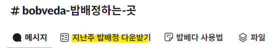
3. 최초 1회는 멤버 파일 업로드가 필요합니다. 채널에서 지난주 밥배정 다운받기 탭에 들어가 지난주의 txt 파일을 다운받습니다.
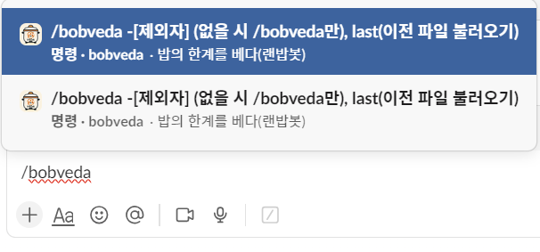
4. 명령어를 입력합니다.
```
제외할 사람이 없을 때: /bobveda
제외할 사람이 있을 때: /bobveda -김민정, 옹미령
```
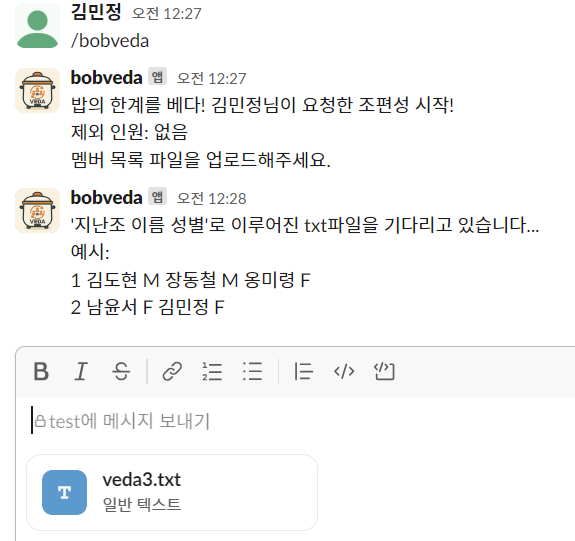

5. 3번에서 받은 최초 파일을 업로드 합니다.
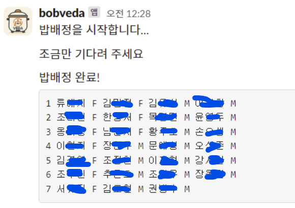

6. 밥배정이 완료되었습니다. 최초 1회 파일 업로드 이후에는 파일 업로드 없이 사용가능한 명령어가 활성화 됩니다.
```
제외할 사람이 없을 때: /bobveda last
제외할 사람이 있을 때: /bobveda last -김도현, 장동철, 남윤서
```


## 프로젝트 구조
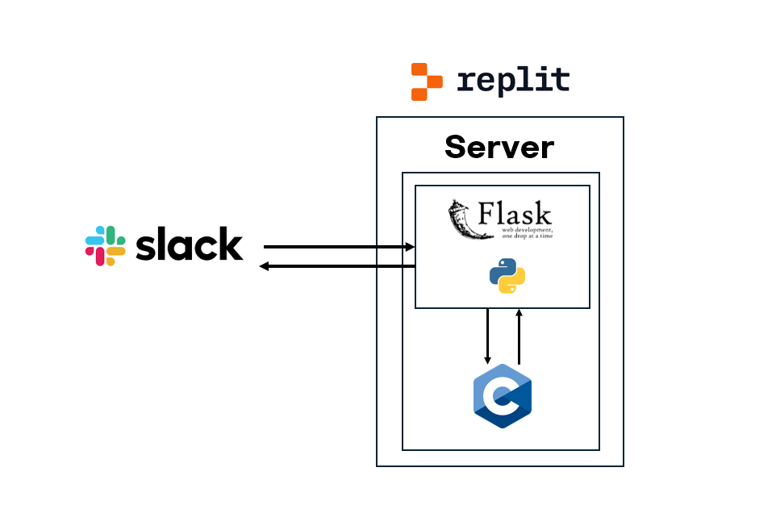

``` 📁 프로젝트 폴더 구조 ├── main.c // 프로그램 실행 시작 지점 (main 함수) ├── struct.h // 공통 구조체 정의 ├── absent.c ├── absent.h // 제외자(결석자) 처리 관련 함수 ├── file.c ├── file.h // 파일 입출력 (입력 읽기 / 결과 저장) ├── randomize.c └── randomize.h // 무작위 조 편성 로직 ``` 


## 기능 소개
```
제외인원x, 파일 직접 업로드: /bobveda 
제외인원O, 파일 직접 업로드: /bobveda -김한화
제외인원x, 파일 서버에서 불러옴: /bobveda last
제외인원O, 파일 서버에서 불러옴: /bobveda last -김한화
```
### /bobveda

제외 인원 없이 파일 업로드를 통해 조를 구성할 때 사용하는 명령어입니다.

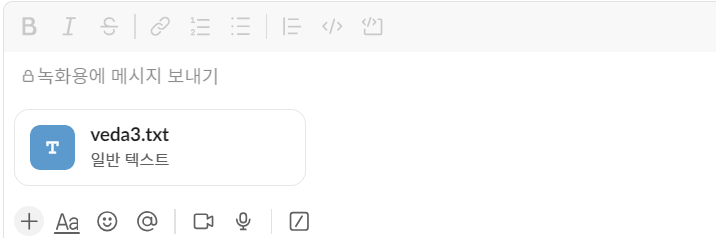
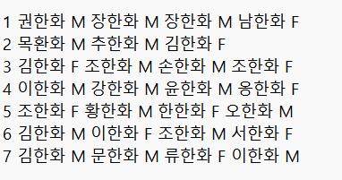

[지난조 이름 성별]로 이루어진 txt파일을 업로드 합니다.
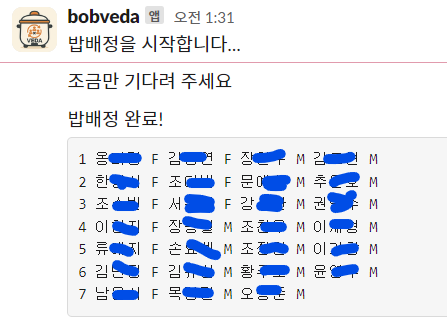
지난조와 중복되지 않은 조로 팀이 구성됩니다. 또한 파일이 서버에 저장됩니다.

### /bobveda -제외할 사람
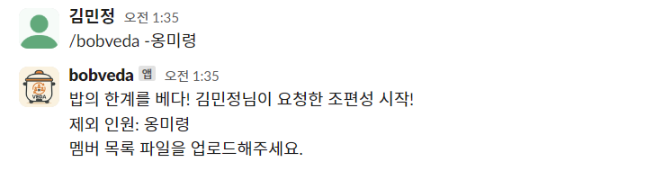
제외할 인원을 추가하여 파일을 업로드하는 방식입니다.
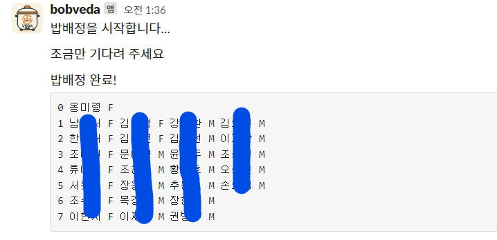
제외할 인원이 0번 조에 할당되어 제외된 채로 팀이 구성됩니다.

### /bobveda last
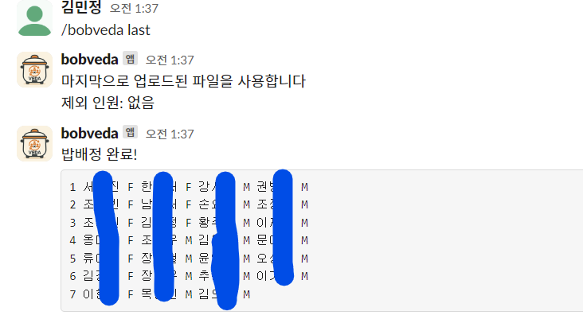
서버에 업로드 된 파일을 이용하여 팀을 구성합니다.

### /bobveda last -제외할 사람
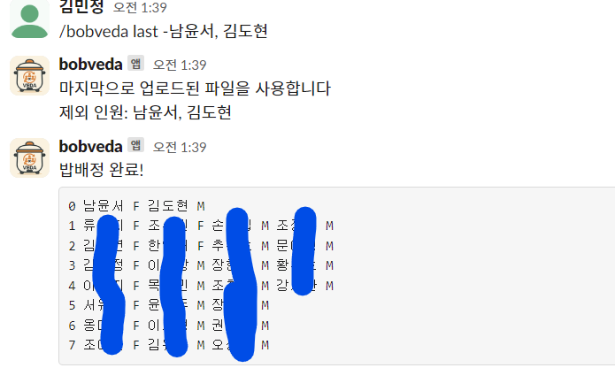
서버에 업로드 된 파일에서 제외할 인원을 빼고 팀이 구성됩니다.

## 발전 가능성
- slack 내에서 파일 관리 명령어 추가
- 인원수 제한 없도록 업데이트

## 팀 소개
자주 자습하는 사람들

[김민정](https://github.com/MIN60) [옹미령](https://github.com/meryoung2025)
[김도현](https://github.com/eoyeok) [남윤서](https://github.com/Yunseo3) [장동철](https://github.com/kmscallkkk)
